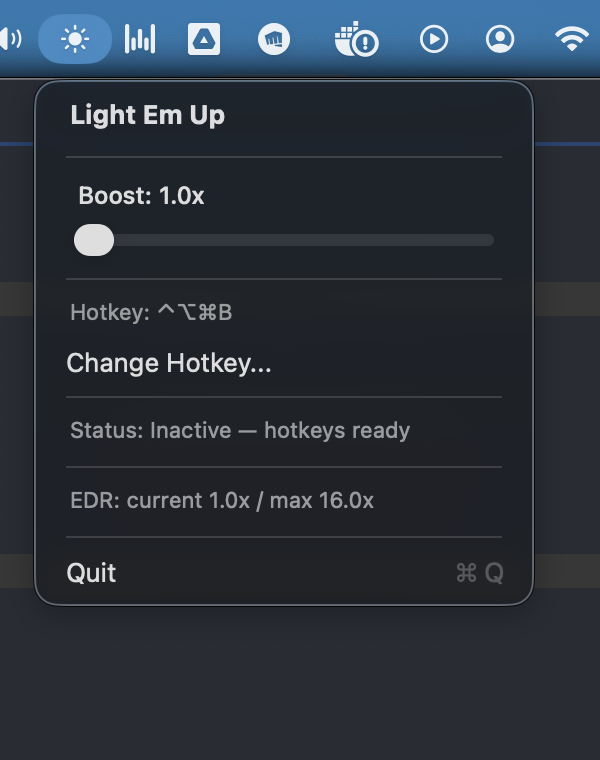
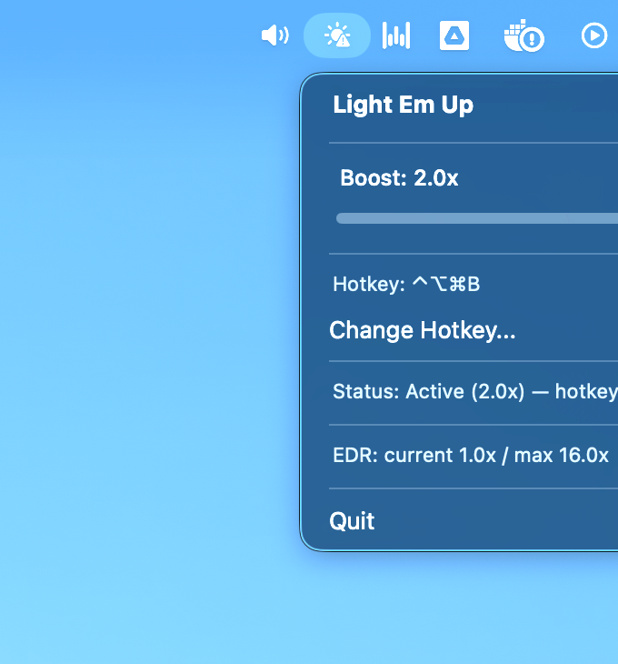

# Light Em Up

Boost your MacBook display beyond standard brightness — for free.

Light Em Up unlocks the HDR/EDR brightness range built into Apple XDR displays, letting you push screen brightness up to 2x the standard SDR limit. Perfect for working outdoors or in bright environments.

<p align="center">
  
  &nbsp;&nbsp;&nbsp;&nbsp;
  
</p>
<p align="center">
  <em>Left: Normal brightness (1.0x) · Right: Boosted to 2.0x</em>
</p>

## Download

Grab the latest `.dmg` from [Releases](../../releases).

## How It Works

MacBook Pro XDR displays can output up to 1000+ nits for HDR content, but macOS limits standard (SDR) content to ~500 nits. Light Em Up adjusts the display's gamma transfer table to map SDR output into the EDR (Extended Dynamic Range) range, effectively doubling your available brightness while preserving colors and contrast.

No overlays, no hacks — just the same technique macOS uses for HDR video, applied to your entire screen.

## Features

- **Menu bar app** — lives in your menu bar, out of the way
- **Simple slider** — drag to boost from 1.0x (normal) to 2.0x brightness
- **Configurable global hotkey** — toggle boost from any app (default: `⌃⌥⌘B`)
- **Lightweight** — no background processes, no Electron, just native Swift
- **Free and open source** — MIT licensed

## Requirements

- **macOS 13+**
- **MacBook Pro 14" or 16"** with M-series Pro/Max/Ultra chip (XDR display)
- **Pro Display XDR**

Non-XDR displays (MacBook Air, Intel Macs, Studio Display) don't have the extra brightness headroom, so the app won't have any visible effect.

## Installation

1. Download the latest `.dmg` from [Releases](../../releases)
2. Open the DMG and drag **Light Em Up** to **Applications**
3. Launch Light Em Up from Applications
4. On first launch, grant **Accessibility** permission (needed for the global hotkey):
   - The app will guide you through this
   - System Settings → Privacy & Security → Accessibility → add Light Em Up

## Usage

- Click the **sun icon** in the menu bar
- **Drag the slider** to increase brightness (1.0x = normal, 2.0x = max)
- Press the **global hotkey** to toggle boost on/off from anywhere (default: `⌃⌥⌘B`)
- **Change the hotkey**: click "Record" in the menu and press your preferred key combination

## Building from Source

```bash
git clone https://github.com/chomey/lightemup.git
cd lightemup
./build.sh
open build/LightEmUp.app
```

To create a distributable DMG:

```bash
./create_dmg.sh
# Output: dist/LightEmUp.dmg
```

Requires Xcode Command Line Tools (`xcode-select --install`).

## License

MIT — see [LICENSE](LICENSE).
